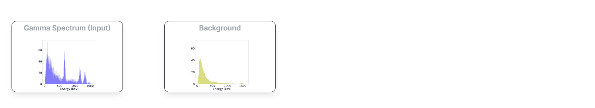

# GammaBench
 

A benchmark comparing machine learning and statistical spectral unmixing for automatic identification and quantification in gamma-ray spectrometry.

The codes are organized as follows:
-  The codes folder contains the source code for spectral unmixing and ML:
      - [CNN for identification and quantification](codes/CNN_classification_regression.py)
      - [POMP algorithm for known spectral signatures](codes/POMP_algo.py)
      - [MoSeVa algorithm for spectral deformation](codes/MoSeVa_algo.py)
      - [POMP algorithm for gain shift](codes/POMP_drift_algo.py)
      - Additional files: [IAE code](codes/IAE_CNN_TORCH_Oct2023.py), [Generate and load data for ML](codes/data_ML.py), [Read data](codes/read_data.py)
-  The Data folder contains the dataset of 96 spectral signatures of 9 radionuclides as a function of steel thickness and spectral singatures with gain shift:
      - [Spectral signatures with deformation](data/Simulation_steel_sphere), [Spectral signatures with spectral shift](data/drift_data)
      - [Dataset for ML models with known spectral signatures](data/Data_spectra_gamma_200000_wo_variability), [Dataset for ML models with spectral deformations](data/Data_spectra_gamma_200000_variability_wo_I131), [Dataset for ML models with spectral shift](data/Data_spectra_gamma_200000_wo_variability_drift)
      - [Natural background](data/SPS_NaITl_3pouces_Exp_1keVCanal_Max2200keV_#20012023A.txt)
      - Results of spectral unmixing for test dataset: [POMP](data/resultat_pomp), [MoSeVa](data/resultat_moseva_wo_I131), [POMP for spectral shift](data/data/result_pomp_drift_all)
       
-  Pre-trained models:
      - [IAE](notebooks/Models/IAE_CNN_12radio_40data.pth), [CNN models](notebooks/lightning_logs)
-  The Notebooks folder contains jupyter notebook files:
      - [Spectral unmixing](notebooks/POMP_MoseVa_identification_quantification.ipynb)
      - [CNN for identification and comparaison](notebooks/Gamma_identification.ipynb)
      - [CNN for quantification and comparaison](notebooks/Gamma_quantification.ipynb)

## Package requirements
The codes are implemented using Pytorch. To do it, you will need the packages listed in environment.yml. To create and activate a conda environment with all the imports needed, do:
-  conda env create -f environment.yml
-  conda activate pytorch
  
If there is a problem with the installation of Pytorch , please follow this link to install it correctly: [Pytorch (Cuda or CPU)](https://pytorch.org/get-started/locally/)

##  Test the code
-  Run [POMP_MoseVa_identification_quantification.ipynb](notebooks/POMP_MoseVa_identification_quantification.ipynb) if you want to see how to use the spectral unmixing code.
-  Run [Gamma_identification.ipynb](notebooks/Gamma_identification.ipynb), [Gamma_quantification.ipynb](notebooks/Gamma_quantification.ipynb) if you want to see how to use CNN codes for identification, quantification and compare the results between different methods.
